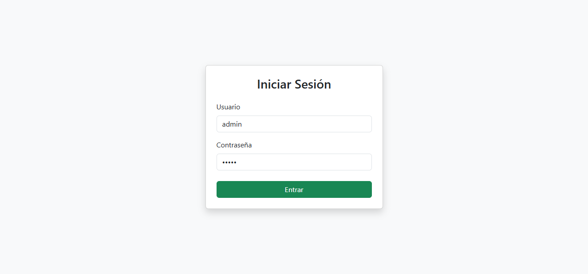
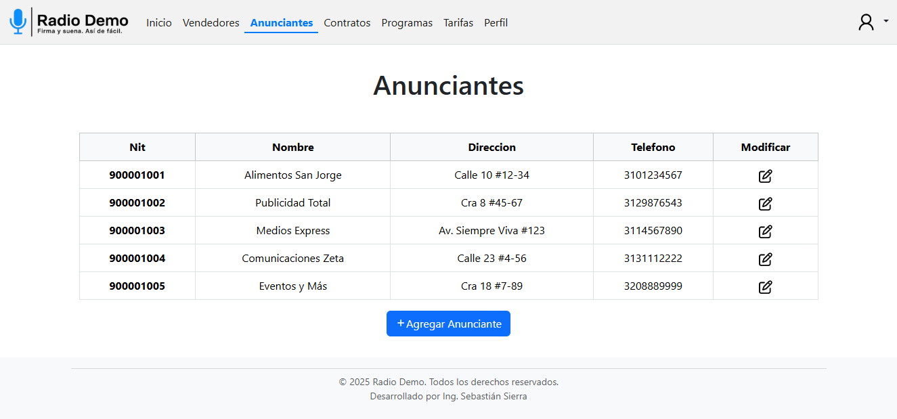
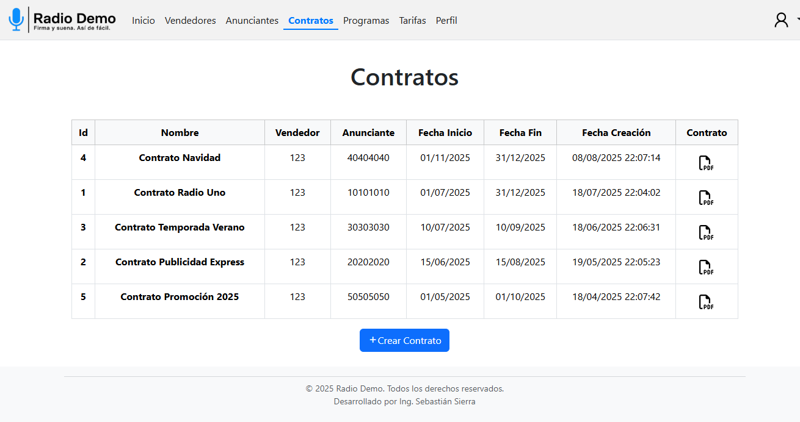
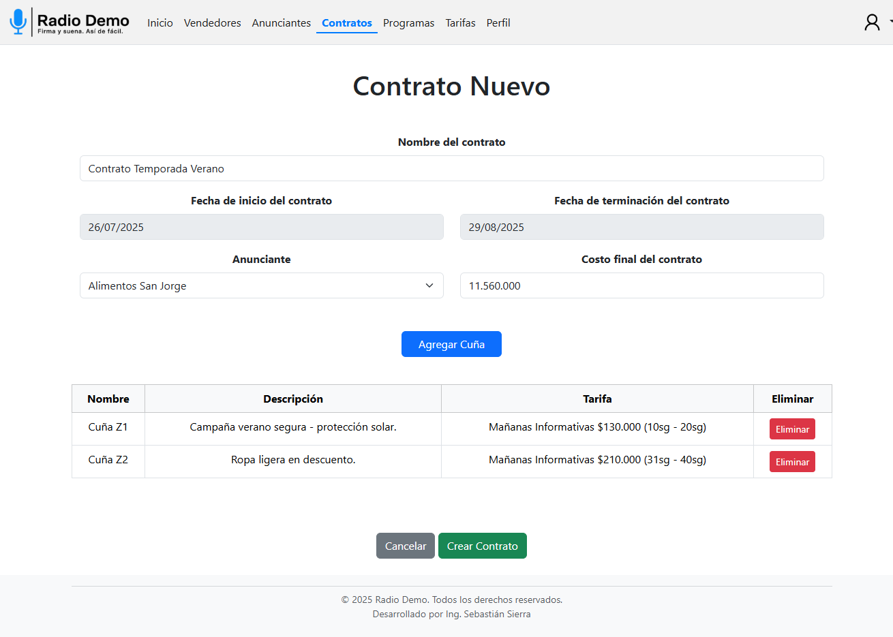
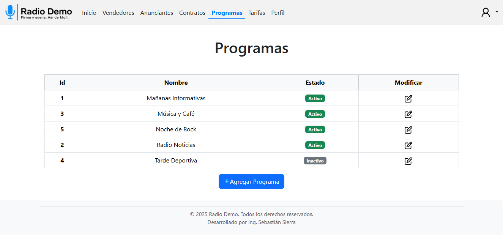
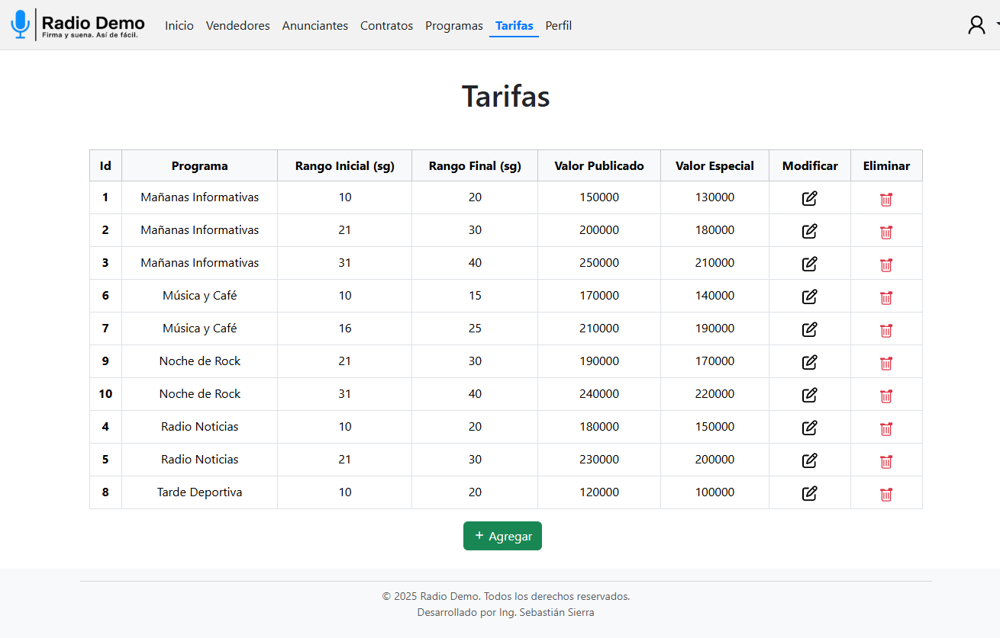
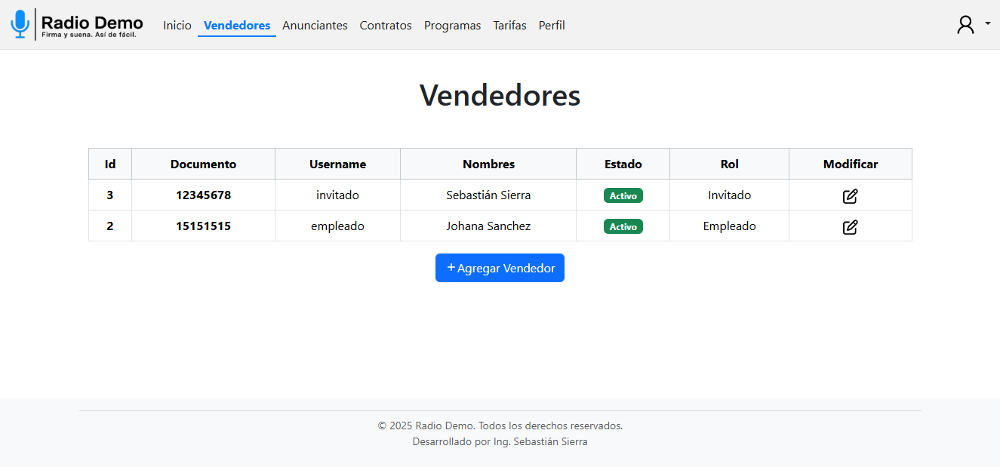

# 📸 Capturas del Sistema – RadioDemo

A continuación se presenta una galería visual de las principales vistas del sistema **RadioDemo**:

---

## 🔐 Pantalla de Inicio de Sesión

---

## 🏠 Dashboard de Inicio

Resumen con las estadísticas principales del sistema: contratos activos, anunciantes y vendedores registrados.

---

## 📣 Gestión de Anunciantes

Permite registrar, editar y buscar anunciantes con datos personales y de contacto.

---

## 📄 Gestión de Contratos

Visualiza los contratos creados con opción de descarga de PDF, búsqueda y filtros.

---

## 📝 Crear Contrato

Formulario para registrar contratos con cuñas asociadas, fechas válidas y selección de anunciante.

---

## 📻 Gestión de Programas

Permite agregar y editar programas radiales disponibles para las tarifas.

---

## 💰 Gestión de Tarifas

Asocia tarifas a programas con rangos de audiencia y valores personalizados.

---

## 🧑‍💼 Gestión de Vendedores

Registra y edita los usuarios del sistema con su respectivo rol, estado y datos personales.

---
